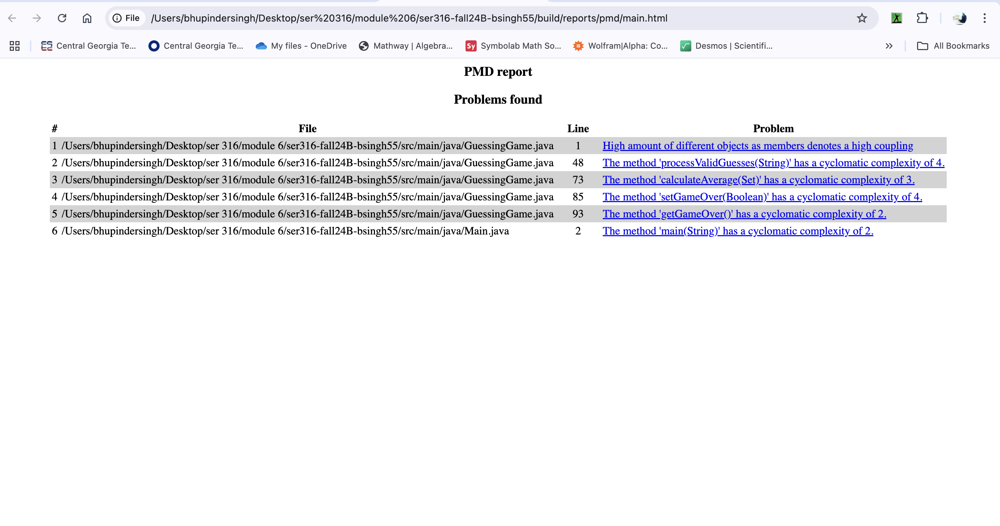
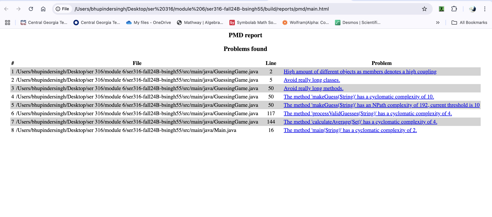
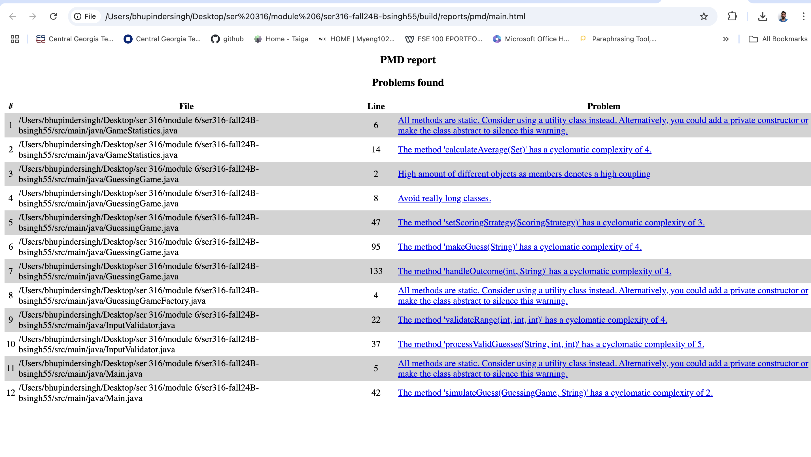

# Module 6 Assignment

**Name:** Bhupinder Singh  
**GitHub Repository Link:** [ser316-fall24B-bsingh55 (Metrics2 Branch)](https://github.com/singhbhupinder55/ser316-fall24B-bsingh55/tree/metrics2)

# Task 1: PMD Setup and Metrics Analysis

## Overview

For Task 1, the PMD plugin was integrated into the project to analyze the code quality based on predefined rules in the `ruleset.xml` file. The PMD report highlights key metrics and rule violations to help identify areas for refactoring and code improvement.

## PMD Setup

1. **Branch Creation**:
    - A new branch `metrics1` was created from the `Blackbox` branch to isolate Task 1 changes.

2. **Configuration**:
    - The PMD plugin was added to the `build.gradle` file.
    - The `ruleset.xml` file, provided as part of the assignment, was placed in the same directory as `build.gradle`.
    - PMD was configured to generate HTML reports and use the custom rule set.

3. **Execution**:
    - The `gradle build` command was run to analyze the code, resulting in a report located at:
        - `build/reports/pmd/main.html`.

## PMD Metrics and Findings

| **File**          | **Line** | **Rule**                    | **Explanation**                                                                                                                                          |
|--------------------|----------|-----------------------------|----------------------------------------------------------------------------------------------------------------------------------------------------------|
| `GuessingGame.java` | 1        | `CouplingBetweenObjects`    | High coupling due to excessive object dependencies.                                                                                                     |
| `GuessingGame.java` | 48       | `CyclomaticComplexity`       | Method `processValidGuesses(String)` exceeds complexity threshold (4).                                                                                   |
| `GuessingGame.java` | 73       | `CyclomaticComplexity`       | Method `calculateAverage(Set)` exceeds complexity threshold (3).                                                                                         |
| `GuessingGame.java` | 85       | `CyclomaticComplexity`       | Method `setGameOver(Boolean)` exceeds complexity threshold (4).                                                                                          |
| `GuessingGame.java` | 93       | `CyclomaticComplexity`       | Method `getGameOver()` exceeds complexity threshold (2).                                                                                                 |
| `Main.java`        | 2        | `CyclomaticComplexity`       | Method `main(String)` exceeds complexity threshold (2).                                                                                                  |

## Screenshot of the PMD Report
Below is the screenshot of the PMD report:

## Analysis of Results

1. **High Coupling**:
    - The `CouplingBetweenObjects` rule was violated in `GuessingGame.java` due to a high number of object dependencies.
    - This can make the code harder to test and maintain.

2. **Cyclomatic Complexity**:
    - Multiple methods exceeded the complexity thresholds set in the `ruleset.xml` file.
    - High complexity can make methods harder to understand and maintain.

## Conclusion

The PMD analysis identified several areas of improvement in the code, primarily focusing on high coupling and cyclomatic complexity. These metrics highlight issues that could lead to reduced maintainability and increased difficulty in testing. For example, methods like `processValidGuesses` and `setGameOver` have higher-than-ideal complexity, which suggests they should be simplified or refactored to improve readability and maintainability.

# Task 2: PMD Analysis Comparison

## Overview

Task 2 focuses on comparing the PMD analysis results from the `metrics1` and `metrics2` branches. The purpose is to evaluate the impact of work from Assignments 2-4 on code quality.

## Comparison of Results

| **Metric**              | **Metrics1** | **Metrics2** | **Change**                    |
|--------------------------|--------------|--------------|--------------------------------|
| Number of Violations     | 6            | 8            | Increased by 2                |
| High Coupling            | 1            | 1            | No change                     |
| Cyclomatic Complexity    | 6 violations | 5 violations  | Slight improvement in methods |
| Long Methods or Classes  | 0            | 2            | New violations introduced     |
| NPath Complexity         | 0            | 1            | New violation introduced      |

## Key Observations

1. **Increase in Violations**:
    - The total number of PMD violations increased from 6 in `metrics1` to 8 in `metrics2`.
    - New violations related to long methods and classes were introduced.

2. **Cyclomatic Complexity**:
    - While cyclomatic complexity remains an issue, some methods showed slight improvements.
    - However, new violations were introduced for the `makeGuess(String)` method.

3. **NPath Complexity**:
    - The `makeGuess(String)` method introduced an NPath Complexity violation with a value of 192, far exceeding the threshold.

## PMD Report Screenshot

Below is the screenshot of the PMD report for `metrics2`:

## Conclusion

The work from Assignments 2-4 led to the introduction of additional violations, such as long methods and classes, and increased NPath complexity. While there are minor improvements in cyclomatic complexity, further refactoring is needed to address these issues and reduce code smells.

# Task 3.1: Making Code More Adaptable

## Objective
The goal of Task 3.1 was to enhance the `GuessingGame` class by:
1. Introducing dynamic difficulty levels to set the range of numbers randomly.
2. Implementing adaptable scoring strategies to provide flexibility in scoring methods.

---

## Description of Changes

### 1. Dynamic Number Ranges
- Added a `DifficultyLevel` enum with three levels: `EASY`, `MEDIUM`, and `HARD`.
- Modified the `GuessingGame` class to set a random target number (`correctNumber`) based on the selected difficulty:
   - **EASY**: Numbers between 1 and 10.
   - **MEDIUM**: Numbers between 1 and 50.
   - **HARD**: Numbers between 1 and 100.

---

### 2. Adaptable Scoring Strategies
- Introduced a `ScoringStrategy` interface, allowing different scoring methods to be implemented.
- Added two scoring strategies:
   - **SimpleScoring**: Deducts points based on the number of incorrect guesses.
   - **TimeBasedScoring**: Rewards points based on how quickly the correct number is guessed.

---

## Impact of Changes

### Advantages
1. **Increased Flexibility**:
   - The game now supports varying difficulty levels and scoring methods, making it more versatile.

2. **Improved Scalability**:
   - Adding new difficulty levels or scoring strategies is straightforward without altering existing logic.

### Potential Downsides
- **Increased Complexity**:
   - Introducing more configuration options could make testing more complex.
- **Maintenance**:
   - Additional features (e.g., new scoring strategies) might increase the maintenance burden.

---

## Test's
  - All the tests are still passing when running the gradle run command.

## Conclusion
The refactoring in Task 3.1 significantly improves the adaptability of the `GuessingGame` class. The new features allow the game to scale easily, provide varied gameplay experiences, and adhere to clean coding principles.

### Task 3.2: Duplicate or Similar Code

#### Problem Description:
The project contained duplicate and similar code in various areas, including state management, input validation, and difficulty range handling. Additionally, multiple constructors added unnecessary complexity. Methods like `makeGuess` also had high cyclomatic complexity due to nested conditional logic.

#### Changes Suggested and Rationale:
1. **State Management:**
    - Centralized all state-related logic in a dedicated `GameState` class.
    - This reduces duplication and provides a single source of truth for managing game state (`gameOver`, `guessCount`, `score`).

2. **Input Validation:**
    - Moved all input parsing and validation logic to an `InputValidator` class.
    - This eliminates repetitive validation code across the application and adheres to the single responsibility principle.

3. **Difficulty Range Handling:**
    - Encapsulated difficulty-specific range logic in the `DifficultyLevel` enum.
    - This makes the code more maintainable and adaptable to future changes in difficulty levels.

4. **Constructor Simplification:**
    - Replaced multiple constructors with a **Factory Method** design pattern.
    - The `GuessingGameFactory` class handles object creation, improving flexibility and eliminating redundancy.

5. **Method Complexity Reduction:**
    - Decomposed large methods like `makeGuess` into smaller helper methods (`validateGuess`, `handleOutcome`, `handleGameOver`).
    - This reduces cyclomatic complexity and improves readability and testability.

#### Changes Implemented in Code:
1. **Centralized Logic:**
    - Moved state management to `GameState`.
    - Centralized validation logic in `InputValidator`.

2. **Factory Method:**
    - Implemented `GuessingGameFactory` to handle `GuessingGame` creation with custom difficulty and scoring strategies.

3. **Refactored Methods:**
    - Simplified `makeGuess` by extracting logic into helper methods.
    - Reduced code duplication and improved separation of concerns.

#### Impact of Changes:
1. **Code Maintainability:**
    - Improved modularity by separating responsibilities across dedicated classes.
    - Easier to extend and adapt for future requirements (e.g., new scoring strategies or difficulty levels).

2. **Readability:**
    - Simplified complex methods, making the code easier to understand.

3. **Testing**
    - All the tests still workings.

#### Remaining Work:
As of now, all duplicate or similar code has been addressed, and the changes have been implemented. The cyclomatic complexity of some methods is still slightly high but within acceptable thresholds due to the nature of their logic.

## Task 4: Identifying Code Smells

### Overview of Code Smells and Added Rules
Code smells are indicators of potential issues in code design and implementation that may hinder readability, maintainability, or scalability. For Task 4, we enhanced the PMD ruleset to detect specific code smells in the project. The following rules were added:

- **Cyclomatic Complexity**: Identifies methods with excessive decision-making logic.
- **Coupling Between Objects**: Detects high coupling between classes, suggesting the need for modularization.
- **Excessive Class/Method Length**: Flags overly long classes or methods, promoting single-responsibility design.
- **Static Methods**: Detects improper use of static methods and suggests using utility classes or singleton patterns.
- **Avoid Duplicate Literals**: Helps reduce redundant strings or literals in the code.
- **Too Many Methods**: Flags classes with an excessive number of methods, indicating potential overloading of responsibilities.
- **Field Declarations Should Be At Start Of Class**: Ensures consistent ordering of fields for better readability.
- **Avoid Reassigning Parameters**: Discourages modifying input parameters directly, which could lead to bugs.
- **Law of Demeter**: Highlights violations of the Law of Demeter, promoting better encapsulation.
- **Avoid Deeply Nested If Statements**: Encourages refactoring of deeply nested conditions for clarity.
- **Excessive Parameter List**: Flags methods with too many parameters, suggesting the need for better encapsulation or design.

### Findings from Updated PMD Report
After running PMD with the updated ruleset, the following code smells were identified:
1. **High Coupling**:
   - The `GuessingGame` class was flagged for having too many dependencies, suggesting decoupling and modularization.
2. **Cyclomatic Complexity**:
   - Methods such as `makeGuess`, `handleOutcome`, and `processValidGuesses` exceeded the complexity threshold, indicating they need simplification.
3. **Static Methods**:
   - Classes like `GameStatistics`, `GuessingGameFactory`, and `InputValidator` were flagged for having only static methods, which could be converted to utility classes or restructured for better design.
4. **Excessive Parameter List**:
   - Some methods were flagged for having too many parameters, which could be simplified by creating encapsulating objects.
5. **Avoid Duplicate Literals**:
   - Repeated string literals were detected, suggesting they should be extracted into constants for reuse.
6. **Law of Demeter**:
   - Violations were identified, suggesting that some methods accessed too many intermediate objects, reducing encapsulation.

### Justification for Added Rules
The added rules aim to address specific areas of improvement:
- **Maintainability**: By identifying overly complex methods, deep nesting, and duplicate literals, the rules promote cleaner and more maintainable code.
- **Readability**: Encouraging field declarations at the start of classes and refactoring excessive parameter lists improves readability.
- **Design Principles**: Enforcing the Law of Demeter, avoiding static methods, and limiting coupling aligns with best design practices.

### Actions Taken
- The ruleset file was updated with new rules targeting common code smells, as outlined above.
- PMD was rerun, and the flagged issues were analyzed and documented.
- The new ruleset helps ensure adherence to clean coding practices as taught in lectures and Fowler's book.

### Screenshots
Below is the PMD report generated after adding the new rules and running it on the project:

---

This analysis concludes Task 4 and ensures a thorough identification of code smells, aiding future refactoring efforts.

## Task 5: Final Check 

### Analysis of the Current Codebase

After reviewing the refactoring work, PMD reports, and the current codebase, there are several observations on areas for further improvement. This section highlights potential refactorings that could enhance code quality, along with a justification of why the code is in a relatively good state after refactoring.

---

### Areas for Improvement

1. **Cyclomatic Complexity**
   - **Problem**: Methods such as `makeGuess`, `handleOutcome`, and `processValidGuesses` still have a cyclomatic complexity higher than desirable.
   - **Why This Matters**: High complexity makes methods harder to read, test, and maintain.
   - **Suggested Solution**: Break these methods into smaller, focused helper methods that adhere to the Single Responsibility Principle.

2. **Single Responsibility Principle (SRP) Violations**
   - **Class Affected**: `GuessingGame`.
   - **Problem**: The `GuessingGame` class manages game state, scoring, and guesses, violating SRP.
   - **Suggested Solution**:
      - Introduce a dedicated `ScoreManager` class for scoring logic.
      - Create a `GuessManager` class to handle guess validation and management.

3. **Utility Classes with Static Methods**
   - **Classes Affected**: `GameStatistics` and `InputValidator`.
   - **Problem**: These classes currently only contain static methods, reducing flexibility for future extensions.
   - **Suggested Solution**:
      - Add a private constructor to indicate their utility purpose.
      - Alternatively, convert them into instance-based classes for more extensibility.

4. **Long Methods**
   - **Methods Affected**: `makeGuess` and `processValidGuesses`.
   - **Problem**: Long methods are harder to read and understand.
   - **Suggested Solution**: Refactor these methods by extracting smaller helper methods to handle specific responsibilities.

5. **Excessive Parameter Lists**
   - **Methods Affected**: `processValidGuesses`.
   - **Problem**: Long parameter lists reduce readability and maintainability.
   - **Suggested Solution**: Use a `Range` object to encapsulate lower and upper bounds into a single parameter.

6. **Tight Coupling**
   - **Class Affected**: `GuessingGame`.
   - **Problem**: Direct access to `GameState` methods creates unnecessary coupling.
   - **Suggested Solution**: Encapsulate `GameState` logic within higher-level methods in `GuessingGame`.

---

### Why the Code Is in a Good State

Despite the areas for potential improvement, the code has improved significantly through the refactoring process:

1. **Improved Adaptability**:
   - The use of the `DifficultyLevel` enum simplifies changes to difficulty levels.
   - The `ScoringStrategy` interface enables flexible integration of different scoring mechanisms.

2. **Reduced Code Duplication**:
   - Refactoring consolidated redundant logic, such as guess validation and scoring calculations.

3. **Improved Testability**:
   - Breaking the logic into smaller components (e.g., `GameState`, `ScoringStrategy`) makes it easier to write and run unit tests for individual parts.

4. **Alignment with Design Patterns**:
   - The introduction of the Strategy Pattern for scoring demonstrates adherence to clean code principles.

---

### Remaining Code Smells and Suggestions

The following smells remain but are not critical to fix immediately:

1. **High Coupling**:
   - Some classes, such as `GuessingGame`, directly access multiple components (`GameState`, `InputValidator`), creating dependencies that could be reduced by better encapsulation.

2. **Potential for Over-Engineering**:
   - While the `ScoringStrategy` interface adds flexibility, it may not be necessary for such a small application. Simplifying this might reduce code overhead.

3. **Excessive Method Length**:
   - Methods like `makeGuess` are still longer than ideal. While this does not currently affect functionality, it can impact future readability.

---

### Final Conclusion

The refactored code is significantly better than its initial state, demonstrating improved adaptability, reduced duplication, and better adherence to design principles. However, addressing the areas highlighted above would further improve code quality, making it more maintainable and scalable in the long term.

